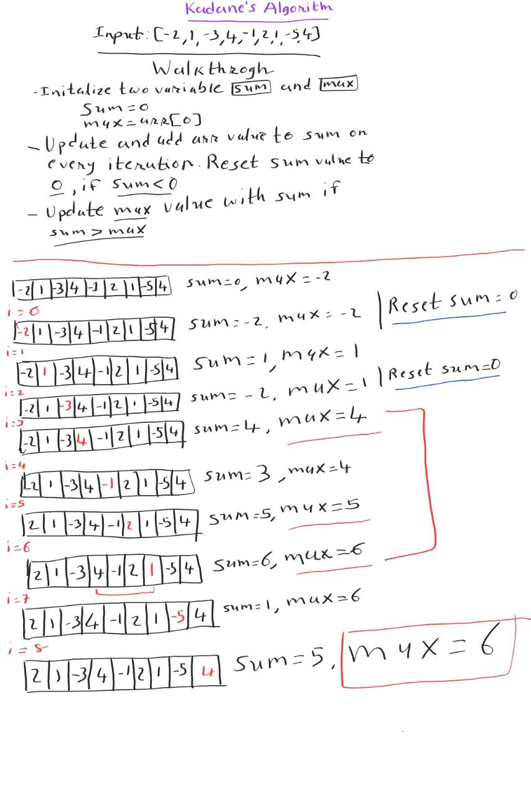

# layman-to-ninja
List of coding problems

## Practice Problems

<details><summary>Fibonacci Numbers</summary>

```Java
package org.example;

import java.util.Arrays;

public class FibonacciNumber {

    public static void main(String[] args) {
        int n = 7;
        // recursive solution
        System.out.println(fib_recursive(n));

        // Dynamic programming
        int[] dp_arr = new int[n+1];
        Arrays.fill(dp_arr, -1);
        System.out.println(fib_memoization(n, dp_arr));
    }

    public static int fib_recursive(int n) {
        // base case
        if(n <= 1) return n;

        // recursive call
        return fib_recursive(n-1) + fib_recursive(n-2);
    }

    public static int fib_memoization(int n, int[] dp) {
        // base case
        if(n <= 1) return n;

        // if dp arr has value; use that
        if(dp[n] != -1) return dp[n];

        // Compute and Memoize the answer
        dp[n] = fib_memoization(n-1, dp) + fib_memoization(n-2, dp);
        return dp[n]; // first memoize; then return
    }

}

```
</details>

<details><summary>Longest Common Subsequence</summary>

##### Description

> A subsequence of a string is a new string generated from the original string with some characters (can be none) deleted without changing the relative order of the remaining characters.
> 
> For example, `"ace"` is a subsequence of `"abcde"`.
> 
> A common subsequence of two strings is a subsequence that is common to both strings.
>
> **Example**<br>
> **Input:** text1 = "abcde", text2 = "ace"
> **Output:** 3  
> **Explanation:** The longest common subsequence is "ace" and its length is 3.

Leetcode Link : [https://leetcode.com/problems/longest-common-subsequence/](https://leetcode.com/problems/longest-common-subsequence/)

##### Recursive Tree

[](https://mermaid.live/edit#pako:eNp1VNFOwyAU_RWCD9OIZtC9rCYmk0t_QB8xBluqi21Zus7EOP9d2kLHsHYP2849l3s4B_qNc1NonOK3Vu3e0RPIBtlncynxhsORC5D4asQeLBZD1PECjFvoDAALvJwBdKCcADEwXqb_eaX2e9AlMp-6rdQOlduqSi_W67Jcr0luKtOmF8vl8m6ky8aJRjc398dOfWi02CyO6OEvzHuYOvEnPDd1bZqxzMOqxJfX9EriaTEeLAaWDX9h0cNuBgy4OXTIlOjVHJpiagEaTZh6fOFMGix6jnCGzSwrvA2cjkGFmTCXUxACi3MSNA5KsCioLAoKknFU0JIELf6QRLlwOlPoXePM7yCKDJgXHdkvqNc-5wid6ernCOb3F0UQFaIAjihzNswMy9CM9uEoJN6raFMi8ZbFKlwhY5HdIvlHFkO-Y06Z39RqDCuML7TTDl555pybrgire9UUaG-QaW7t8-yPmG2xxT714f4iToAAJYIAI8J-M5L5C33Xs06f8RIjhAmudVurbWFfSN89Yi_Bu661xKn9Waj2Q2LZ_FjeYVeoToti25kWp6Wq9ppgdejM41eTT8DIgq2yb7faoT-_UNVYiw)

##### Code

```Java
package org.example;

import java.util.Arrays;

public class LongestCommonSubsequence {

    public static void main(String[] args) {

        // input
        char[] str1 = "ACD".toCharArray();
        char[] str2 = "CED".toCharArray();

        // recursive solution
        System.out.println("Recursive solution: " + lcs_rec(0,0, str1, str2));

        // Dynamic programming solution
        int[][] dp_arr = new int[str1.length][str2.length];
        Arrays.stream(dp_arr).forEach(a -> Arrays.fill(a, -1));
        System.out.println("DP solution: " + lcs_memoization(0, 0, str1, str2, dp_arr));
        Arrays.stream(dp_arr).forEach(a -> Arrays.fill(a, -1));
        System.out.println("DP Top down: " + lcs_topdown(str1.length-1, str2.length-1, str1, str2, dp_arr));
    }

    private static int lcs_rec(int i, int j, char[] str1, char[] str2) {
        // base case
        if(i >= str1.length || j >= str2.length)
            return 0;

        // when both ith and jth char matches
        if(str1[i] == str2[j])
            return 1+lcs_rec(i+1, j+1, str1, str2);

        // when ith and jth char does not match
        int left = lcs_rec(i+1, j, str1, str2);
        int right = lcs_rec(i, j+1, str1, str2);
        return Math.max(left, right);
    }

    // This method solves problem in BottomUp approach as we go from 0..n
    private static int lcs_memoization(int i, int j, char[] str1, char[] str2, int[][] dp) {
        // base case
        if(i >= str1.length || j >= str2.length)
            return 0;

        // if dp arr state has changed, use that value
        if(dp[i][j] != -1)
            return dp[i][j];

        // when both ith and jth char matches
        if(str1[i] == str2[j])
            return dp[i][j] = 1 + lcs_memoization(i+1, j+1, str1, str2, dp);

        // when ith and jth char does not match
        int left = lcs_memoization(i+1, j, str1, str2, dp);
        int right = lcs_memoization(i, j+1, str1, str2, dp);
        return dp[i][j] = Math.max(left, right);
    }

    private static int lcs_topdown(int i, int j, char[] str1, char[] str2, int[][] dp) {
        // base case
        if(i < 0 || j < 0)
            return 0;

        // if dp arr state has changed, use that value
        if(dp[i][j] != -1)
            return dp[i][j];

        // when both ith and jth char matches
        if(str1[i] == str2[j])
            return dp[i][j] = 1 + lcs_memoization(i-1, j-1, str1, str2, dp);

        // when ith and jth char does not match
        int left = lcs_memoization(i-1, j, str1, str2, dp);
        int right = lcs_memoization(i, j-1, str1, str2, dp);
        return dp[i][j] = Math.max(left, right);
    }

}
```

> **Recursive solution:** O(n.2^m), where m is the length of the first string and n is the length of the second string.<br>
> **Dynamic Programming:** O(n*m)
</details>

<details>
<summary>Find the Duplicate Number</summary>

##### Description
> Given array of `n+1` numbers contains `[1,n]` inclusive and there is only single repeated number
>
> Example:
> Input: nums = [1,3,4,2,2]
> Output: 2

Leetcode link: [https://leetcode.com/problems/find-the-duplicate-number/](https://leetcode.com/problems/find-the-duplicate-number/)

##### Code

```Java
package org.example;

import java.util.Arrays;
import java.util.NoSuchElementException;

public class FindDuplicateNumber {

    public static void main(String[] args) {
        int[] arr = {1,3,5,2,8,4,7,6,7};
        System.out.println("Optimal solution with linkedlist " +
                "slow and fast pointer :" + findDuplicate(arr));
        System.out.println("Brute force solution with sorting: " + findDuplicate_brute_force(arr));
        System.out.println("Hash frequency count solution: " + findDuplicate_hash_frequency(arr));
    }

    private static int findDuplicate(int[] arr) {
        int slowPtr = arr[0];
        int fastPtr = arr[0];

        do {    // first collision in loop
            slowPtr = arr[slowPtr];
            fastPtr = arr[arr[fastPtr]];
        } while (slowPtr != fastPtr);

        // meet at the start of loop to find duplicate
        fastPtr = arr[0];
        while (slowPtr != fastPtr) {
            slowPtr = arr[slowPtr];
            fastPtr = arr[fastPtr];
        }
        return slowPtr;
    }

    private static int findDuplicate_brute_force(int[] arr) {
        Arrays.sort(arr);
        for(int i=0; i<arr.length-1; i++) {
            if(arr[i] == arr[i+1]) {
                return arr[i];
            }
        }
        throw new NoSuchElementException("No duplicate found");
    }

    private static int findDuplicate_hash_frequency(int[] arr) {
        int[] freq = new int[arr.length];
        Arrays.fill(freq, 0);
        for(int num: arr) {
            freq[num]++;
        }
        for(int i=0; i<freq.length; i++) {
            if(freq[i] == 2)
                return i;
        }
        throw new NoSuchElementException("No duplicate found");
    }
}
```
</details>

<details>
<summary>
Sort an array of 0's 1's & 2's</summary>

##### Description

> Given array of n elements with 0, 1 and 2. Sort the array in single pass.
> 
> This is variation of Dutch National Flag Algorithm using which we can find solution in O(N) time.
> 
> Example:
> 
> Input: nums = [2,0,2,1,1,0]
> 
> Output: [0,0,1,1,2,2]

Leetcode link: [https://leetcode.com/problems/sort-colors/](https://leetcode.com/problems/sort-colors/)

##### Solution

Dutch National Flag Algorithm


##### Code

```Java
package org.example;

import java.util.Arrays;

public class SortColors {

    public static void main(String[] args) {
        int[] arr = {0,0,1,2,0,1,0,1,1,1,2,1,0};
        sortByBruteForce(arr);
        System.out.println();
        sortByCounting(arr);
        System.out.println();
        sortByDutchNationalFlagAlgo(arr);
    }

    private static void swap(int[] arr, int i, int j) {
        int tmp = arr[i];
        arr[i] = arr[j];
        arr[j] = tmp;
    }

    // single pass solution
    private static void sortByDutchNationalFlagAlgo(int[] arr) {
        int low = 0;
        int high = arr.length-1;
        int mid = 0;
        while(mid <= high) {
            switch (arr[mid]) {
                case 0 : {
                    swap(arr, low, mid);
                    low++;
                    mid++;
                    break;
                }
                case 1 : {
                    mid++;
                    break;
                }
                case 2 : {
                    swap(arr, mid, high);
                    high--;
                }
            }
        }
        for(int i: arr) {
            System.out.print(i + " ");
        }
    }

    private static void sortByBruteForce(int[] arr) {
        Arrays.sort(arr);
        for(int i: arr) {
            System.out.print(i + " ");
        }
    }

    // double pass solution O(2N)
    private static void sortByCounting(int[] arr) {
        int cnt_0s = 0;
        int cnt_1s = 0;
        int cnt_2s = 0;
        for(int i: arr) {
            if(i == 0) {
                cnt_0s++;
                continue;
            }
            if(i == 1) {
                cnt_1s++;
                continue;
            }
            cnt_2s++;
        }
        while(cnt_0s != 0 || cnt_1s != 0 || cnt_2s != 0) {
            if(cnt_0s != 0) {
                cnt_0s--;
                System.out.print(0 + " ");
                continue;
            }
            if(cnt_1s != 0) {
                cnt_1s--;
                System.out.print(1 + " ");
                continue;
            }
            cnt_2s--;
            System.out.print(2 + " ");
        }
    }
}
```
</details>

<details>
<summary>
Find the repeating and the missing number
</summary>

##### Description

> Given an unsorted array of size n. Array elements are in the range from 1 to n. One number from set {1, 2, …n} is missing and one number occurs twice in the array. Find these two numbers.
> 
> Example :
> 
> Input: arr[] = {4, 3, 6, 2, 1, 1}
> 
> Output: Missing = 5, Repeating = 1

GFG Problem link: [https://www.geeksforgeeks.org/find-a-repeating-and-a-missing-number/](https://www.geeksforgeeks.org/find-a-repeating-and-a-missing-number/)

##### Solution

Method 1 : Sorting

Approach:
Sort the input array. Traverse the array and check for missing and repeating.

Time Complexity: `O(nLogn)`

Note that after sorting, to find missing and repeating number in single pass is not that simple and intuitive. Do check for corner cases. Check the implementation and verify if that indeed find correct result.


Code:

Input: `int[] arr = {4, 3, 6, 2, 1, 1};`

```Java
    private static void printTwoNumberBySorting(int[] arr) {
        System.out.println("Print by sorting");
        Arrays.sort(arr);
        for(int idx=1,arr_idx=0 ; arr_idx < arr.length;) {
            if(arr[arr_idx] != idx) {
                if(arr[arr_idx] < idx) {
                    System.out.println("Repeating Number: " + arr[arr_idx]);
                    arr_idx++;
                } else {
                    System.out.println("Missing Number: " + idx);
                    idx++;
                }
            } else {
                idx++;
                arr_idx++;
            }
        }
    }
```

Method 2: Print by Hash Frequency- counting

Time Complexity: O(n)

Auxiliary Space: O(n)

```Java
    private static void printTwoNumberByHashFrequency(int[] arr) {
        System.out.println("Print by hash frequency");
        int[] freq_arr = new int[arr.length+1];
        Arrays.fill(freq_arr, 0);
        for(int num: arr) {
            freq_arr[num]++;
        }
        for(int i=1; i<freq_arr.length; i++) {
            if(freq_arr[i] == 2)
                System.out.println("Repeating Number: " + i);
            if(freq_arr[i] == 0)
                System.out.println("Missing Number: " + i);
        }
    }
```

Method 3: Solve by equation

Approach:

- Let `x` be the missing and `y` be the repeating element.
- Get the sum of all numbers using formula `S = n(n+1)/2`
- Get sum of all number squares `S^2 = n(n+1)(2n+1)/6`
- The above two steps give us two equations, we can solve the equations and get the values of `x` and `y`.

In actual `arr` sum `x` will not be there and `y` will be there twice.

suppose give `arr` = `{2, 3, 3, 1, 4}` => 3 is repeating and 5 is missing 

So, `x - y` = `S - arr_sum` ((1+2+3+4+5) - (2+3+3+1+4))
`x - y` = 5 - 3 = 2

`x^2 - y^2` = `S^2 - arr_square_sum` ((1^2+2^2+3^2+4^2+5^2) - (2^2+3^2+3^2+1^2+4^2))
`(x+y)(x-y)` = 5^2 - 3^2 = 25 - 9 = 16

we can replace `x-y` value in above equation

`x+y` = 16/2 = 8

now,

`x-y` = 2

`x+y` = 8

`2x` = 10, `x` = 5, `y` = 3

Time Complexity: `O(n)`

Code

```Java
    private static void printTwoNumberByEquation(int[] arr) {
        System.out.println("Print by equation");
        int n = arr.length;
        long sum = ((long) n *(n+1))/2;
        long square_sum = (n*(n+1)*((2L *n)+1))/6;

        long arr_sum = Arrays.stream(arr).sum();
        long arr_square_sum = Arrays.stream(arr).map(num -> num * num).sum();

        long x_min_y = sum - arr_sum;
        long x_plus_y = (square_sum - arr_square_sum)/x_min_y;

        long x = (x_plus_y + x_min_y)/2;
        long y = x - x_min_y;
        System.out.println("Repeating Number: " + y);
        System.out.println("Missing Number: " + x);
    }
```

Method 4 : Use XOR operation

> XOR operation return `true` only if either condition is true, not both true and not both false. So, 1 and 0 gives 1 other is 0 and 1 gives 1
>
> Also note, number's XOR with self gives `0` as all bit cancel each other. `3^3 = 0`

Approach:

- Let x and y be the desired output elements.
- Calculate XOR of all the array elements.

`XOR = arr[0]^arr[1]^arr[2]…..arr[n-1]`

- XOR the result with all numbers from 1 to n

`XOR = XOR^1^2^…..^n`

- In the result `XOR`, all elements would nullify each other except `x` and `y`. All the bits that are set in `XOR` will be set in either `x` or `y`. So if we take any set bit (We have chosen the rightmost set bit in code) of `XOR` and divide the elements of the array in two sets – one set of elements with same bit set and other set with same bit not set. By doing so, we will get `x` in one set and `y` in another set. Now if we do XOR of all the elements in first set, we will get `x`, and by doing same in other set we will get `y`.
- We put array elements in 2 buckets based on set bit and then again put all elements from 1...n in 2 buckets. So, each bucket cancel all elements except `x` and `y`. As same number XOR cancel each other and gives 0

First 2 XOR operation is just to find set bit position and we took right most set bit

Time Complexity: `O(5n)` as we iterate 5 times i.e `O(n)`

```Java
    private static void printTwoNumberByXOR(int[] arr) {
        System.out.println("Print by XOR");
        int xor_all = 0;

        // get XOR of all arr elements
        for (int i : arr) {
            xor_all ^= i;
        }

        // XOR the above with numbers from 1 to n
        for(int i=1; i<=arr.length; i++) {
            xor_all ^= i;
        }

        int set_bit_no = xor_all & -xor_all;
        int x = 0;
        int y = 0;

        // now divide arr elements in two baskets based on set bit
        for (int j : arr) {
            if ((j & set_bit_no) != 0) {
                x ^= j;
            } else {
                y ^= j;
            }
        }

        for(int i=1; i<=arr.length; i++) {
            if((i & set_bit_no) != 0) {
                x ^= i;
            } else {
                y ^= i;
            }
        }

        // to figure out which one is missing and which one is repeating
        int x_count = 0;
        for(int num: arr) {
            if(num == x) {
                x_count++;
            }
        }
        if(x_count == 2) {
            System.out.println("Repeating Number: " + x);
            System.out.println("Missing Number: " + y);
        } else {
            System.out.println("Repeating Number: " + y);
            System.out.println("Missing Number: " + x);
        }
    }
```

</details>

<details>
<summary>Merge two sorted array in same two array</summary>

##### Description

> Given two sorted arrays, we need to merge them in O((n+m)*log(n+m)) time with O(1) extra space into a sorted array, when n is the size of the first array, and m is the size of the second array.
> 
> Exmple:
> 
> int[] arr1 = {34,35,36,37};
> 
> int[] arr2 = {3,4,5};
> 
> Output: 
> 3 4 5 34
> 
> 35 36 37

GFG problem link: [https://www.geeksforgeeks.org/efficiently-merging-two-sorted-arrays-with-o1-extra-space/](https://www.geeksforgeeks.org/efficiently-merging-two-sorted-arrays-with-o1-extra-space/)

##### Solution

Approach 1 : Selection sort on both array. As both are sorted; compare element from first array with first element of second array and swap if required and sort second array after every swap to keep both array sorted all the time.

Approach 2 : Shellsort - h-sorted array. Here we used h = n/2 and for odd n value we kept h = n/2 + n%2. Shellsort is extension of Insertion sort only, here we try to compare with h distance element instead of next element in array to reduce inversion pair in array. 

##### Code

```Java
package org.example;

public class MergeTwoArrWithConstantSpace {

    public static void main(String[] args) {
        int[] arr1 = {34,35,36,37};
        int[] arr2 = {3,4,5};
        sortTwoArrWithInsertionSort(arr1, arr2);
        printArray(arr1, arr2);
        int[] arr3 = {34,35,36,37};
        int[] arr4 = {3,4,5};
        sortTwoArrWithGapMethod_shellsort(arr3, arr4);
        printArray(arr3, arr4);
    }

    private static void sortTwoArrWithGapMethod_shellsort(int[] arr1, int[] arr2) {
        int n = arr1.length;
        int m = arr2.length;

        int h = (n+m)/2 + (n+m)%2;
        int i, j;
        while(h > 0) { // h-sort the array to swap long distance element

            // compare ele in first arr
            for(i = 0; i+h < n; i++) {
                if(arr1[i] > arr1[i+h]) {
                    int tmp = arr1[i];
                    arr1[i] = arr1[i+h];
                    arr1[i+h] = tmp;
                }
            }

            // compare ele in second arr
            for(j = h>n ? h-n : 0; i < n && j < m; i++,j++) {
                if(arr1[i] > arr2[j]) {
                    int tmp = arr1[i];
                    arr1[i] = arr2[j];
                    arr2[j] = tmp;
                }
            }

            // if we haven't checked all second arr elements
            if(j < m) {
                for(j = 0; j+h < m; j++) {
                    if(arr2[j] > arr2[j+h]) {
                        int tmp = arr2[j];
                        arr2[j] = arr2[j+h];
                        arr2[j+h] = tmp;
                    }
                }
            }
            h = h == 1 ? 0 : h/2 + h%2; // return 0 for h == 1 else infinite loop
        }
    }

    private static void sortTwoArrWithInsertionSort(int[] arr1, int[] arr2) {
        int n = arr1.length;
        int m = arr2.length;

        // apply Insertion sort logic
        for(int i = 0; i < n; i++) {
            if(arr1[i] > arr2[0]) { // comparing only with first ele as both arrays are sorted
                int tmp = arr1[i];
                arr1[i] = arr2[0];
                arr2[0] = tmp;
            }

            // sort second array if not sorted
            for(int j=1; j < m && arr2[j] < arr2[j-1]; j++) {
                int tmp = arr2[j];
                arr2[j] = arr2[j-1];
                arr2[j-1] = tmp;
            }
        }
    }

    private static void printArray(int[] arr1, int[] arr2) {
        // print the sorted arr 1
        for(int num: arr1) {
            System.out.print(num + " ");
        }
        System.out.println();
        // print the sorted arr 2
        for(int num: arr2) {
            System.out.print(num + " ");
        }
        System.out.println();
    }
}
```
</details>

<details>
<summary>
Maximum Subarray Sum - Kadane's Algo
</summary>

##### Description

> Given an integer array `nums`, find the contiguous subarray (containing at least one number) which has the largest sum and return its sum.
>
> A subarray is a contiguous part of an array.
> 
> Exmaple
> 
> Input: nums = [-2,1,-3,4,-1,2,1,-5,4]
> 
> Output: 6
> 
> Explanation: [4,-1,2,1] has the largest sum = 6.

Leetcode problem link: [https://leetcode.com/problems/maximum-subarray/](https://leetcode.com/problems/maximum-subarray/)

##### Solution



##### Code

```Java
package org.example;

public class MaximumSubArraySum {

    public static void main(String[] args) {
        int[] arr = {-2,1,-3,4,-1,2,1,-5,4};
        System.out.println("Maximum subarray sum, Kadane's method: " +
                maxSubArraySum_Kadanes_algo(arr));
        System.out.println("Brute force approach: " +
                maxSubArraySum_bruteforce(arr));
    }

    private static int maxSubArraySum_Kadanes_algo(int[] arr) {
        int sum = 0;
        int max = arr[0];
        for(int num: arr) {
            sum += num;
            if(sum > max) max = sum;
            if(sum < 0) sum = 0;
        }
        return max;
    }

    private static int maxSubArraySum_bruteforce(int[] arr) {
        int max = 0;
        for(int i=0; i<arr.length; i++) {
            int sum = 0;
            for(int j=i; j<arr.length; j++) {
                sum += arr[j];
                max = Math.max(max, sum);
            }
        }
        return max;
    }
}
```
</details>